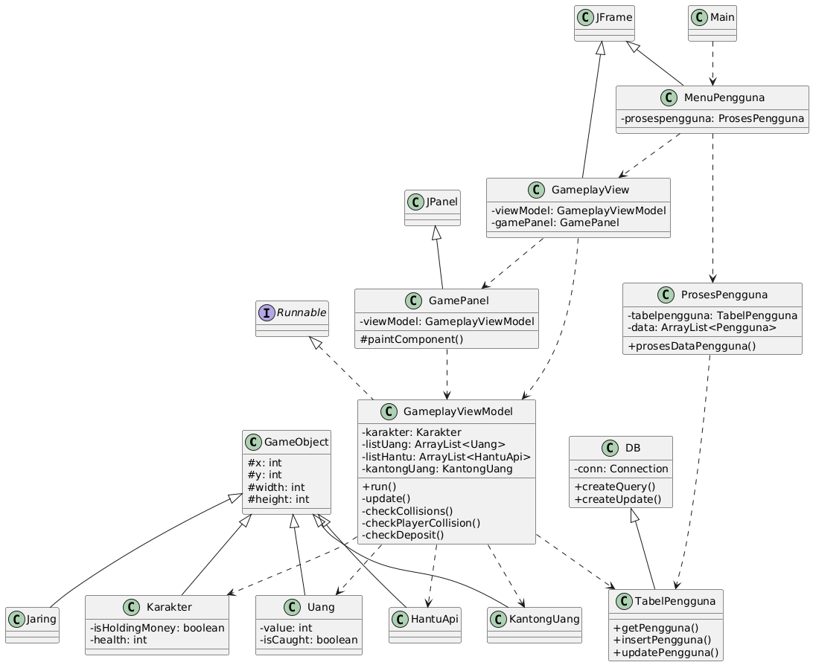

# Proyek Game "CRAB THE KIKIR"

Ini adalah proyek tugas besar untuk mata kuliah Desain dan Pemrograman Berorientasi Objek (DPBO). Game ini dibangun menggunakan bahasa Java dengan library Swing untuk GUI dan menerapkan pola arsitektur **Model-View-ViewModel (MVVM)**.

## Janji Tidak Curang
Saya Abdurrahman Al Ghifari mengerjakan evaluasi Tugas Masa Depan dalam mata kuliah
Desain dan Pemrograman Berorientasi Objek untuk keberkahanNya maka saya
tidak melakukan kecurangan seperti yang telah dispesifikasikan. Aamiin.

## Deskripsi Proyek

Game ini berjudul "Crab The Kikir" dengan tema Tuan Krab yang berburu uang. Pemain akan mengontrol karakter Tuan Krab untuk menangkap uang yang beterbangan sambil menghindari rintangan berupa hantu api. Game ini memiliki sistem skor, nyawa, dan penyimpanan skor tertinggi (high score) ke dalam database.

## Fitur Utama

* **Tampilan Fullscreen Dinamis:** Game berjalan dalam mode fullscreen dan semua elemen visualnya (posisi, batas gerak) beradaptasi secara dinamis dengan resolusi layar.
* **Gameplay Interaktif:**
    * Mekanisme laso yang ditembakkan ke arah kursor mouse.
    * Mekanisme "tangkap, bawa, dan setor" untuk mendapatkan skor.
    * Sistem Nyawa (Health) dengan rintangan musuh (`HantuApi`).
    * Kondisi "Game Over" saat nyawa habis.
* **Objek Dinamis:**
    * Uang dengan nilai poin acak dan berbobot (poin besar lebih jarang).
    * Spawn objek yang aman (tidak saling tumpang tindih).
* **Papan Skor (Scoreboard):**
    * Terhubung dengan database MySQL.
    * Menyimpan skor pemain baru.
    * Memperbarui skor jika pemain mencapai skor tertinggi baru.
    * Menampilkan data yang diurutkan berdasarkan skor tertinggi.
* **Fitur Tambahan:**
    * Menu Jeda (*Pause Menu*) saat permainan berlangsung.
    * Musik latar di layar gameplay.
    * Dialog konfirmasi yang interaktif.

## Arsitektur & Struktur Program

Proyek ini dibangun menggunakan pola arsitektur **MVVM (Model-View-ViewModel)** untuk memisahkan antara data (Model), tampilan (View), dan logika bisnis (ViewModel).

```
src/
└── view/                       # Berisi semua kelas untuk tampilan (JFrame, JPanel)
│    ├── MenuPengguna.java
│    ├── GameplayView.java
│    └── GamePanel.java
├── model/                      # Berisi kelas-kelas data (POJO)
│    ├── GameObject.java
│    ├── Karakter.java
│    ├── Uang.java
│    ├── HantuApi.java
│    ├── Jaring.java
│    ├── KantongUang.java
│    ├── Pengguna.java
│    ├── DB.java
│    └── TabelPengguna.java
├── viewmodel/                  # Berisi kelas-kelas logika
│    ├── ProsesPengguna.java
│    └── GameplayViewModel.java
├── helpers/                    # Berisi kelas-kelas pembantu
│    └── AudioPlayer.java
├── assets/                     # Berisi semua file gambar dan suara
└── Main.java                   # Titik masuk aplikasi

```

* **Model**: Bertanggung jawab atas data dan logika akses database. Contoh: `Karakter.java` menyimpan data posisi dan nyawa, `TabelPengguna.java` mengatur query ke database.
* **View**: Bertanggung jawab atas semua yang dilihat dan diinput oleh pengguna. Contoh: `GamePanel.java` menggambar semua objek, `MenuPengguna.java` menampilkan papan skor.
* **ViewModel**: Bertindak sebagai jembatan antara Model dan View. Semua logika permainan seperti pergerakan, tabrakan, dan aturan main ada di sini. Contoh: `GameplayViewModel.java`.

## Alur Program

1.  **Menu Utama**: Program dimulai dengan menampilkan `MenuPengguna`. Menu ini memuat data dari database melalui `ProsesPengguna` (ViewModel) dan menampilkannya di papan skor.
2.  **Input Username**: Pemain memasukkan username dan menekan "Play". Sebuah dialog konfirmasi akan muncul.
3.  **Gameplay**: Jika dikonfirmasi, jendela `GameplayView` akan terbuka fullscreen.
    * `GameplayViewModel` diinisialisasi, menciptakan semua objek game (Tuan Krab, Uang, Hantu, Kantong Uang).
    * Musik latar mulai diputar.
    * Sebuah `Thread` utama dimulai untuk menjalankan *game loop* (memanggil `update()` dan `repaint()` secara terus-menerus).
4.  **Interaksi**:
    * Pemain menggerakkan Tuan Krab dan menghindari Hantu Api. Jika terkena, nyawa berkurang.
    * Pemain mengklik mouse untuk menembakkan laso. Jika mengenai Uang, uang akan tertarik kembali.
    * Pemain harus membawa Tuan Krab ke Kantong Uang untuk menyetor dan mendapatkan skor.
5.  **Akhir Permainan**:
    * Permainan berakhir jika pemain menekan `Spasi` dan memilih "Kembali ke Menu", atau jika nyawa habis.
    * Skor akhir akan disimpan ke database (hanya jika merupakan skor tertinggi baru).
    * Program kembali ke Menu Utama.

## Diagram Kelas (PlantUML)



## Cara Bermain

* **Gerakan**: Gunakan **Tombol Panah Atas, Bawah, Kiri, Kanan** untuk menggerakkan Tuan Krab di area gurun.
* **Menangkap Uang**: **Klik Kiri Mouse** pada layar untuk menembakkan laso ke arah kursor.
* **Menyetor Uang**: Setelah berhasil menangkap uang, bawa Tuan Krab **mendekati Kantong Uang** untuk menyetor dan mendapatkan skor.
* **Menghindari Musuh**: Hindari kontak dengan **Hantu Api**. Setiap kontak akan mengurangi nyawa.
* **Pause/Jeda**: Tekan **Tombol Spasi** saat bermain untuk menjeda permainan dan menampilkan menu pilihan.

## Kredit Aset

* **Gambar Latar & Atribut Games:** diambil dari Pinterest, dengan lisensi bebas digunakan.
* **Musik Latar:** Spongebob Soundtrack oleh 12th St Rag (youtube.com/watch?v=S6BJoeSoeJg) 

